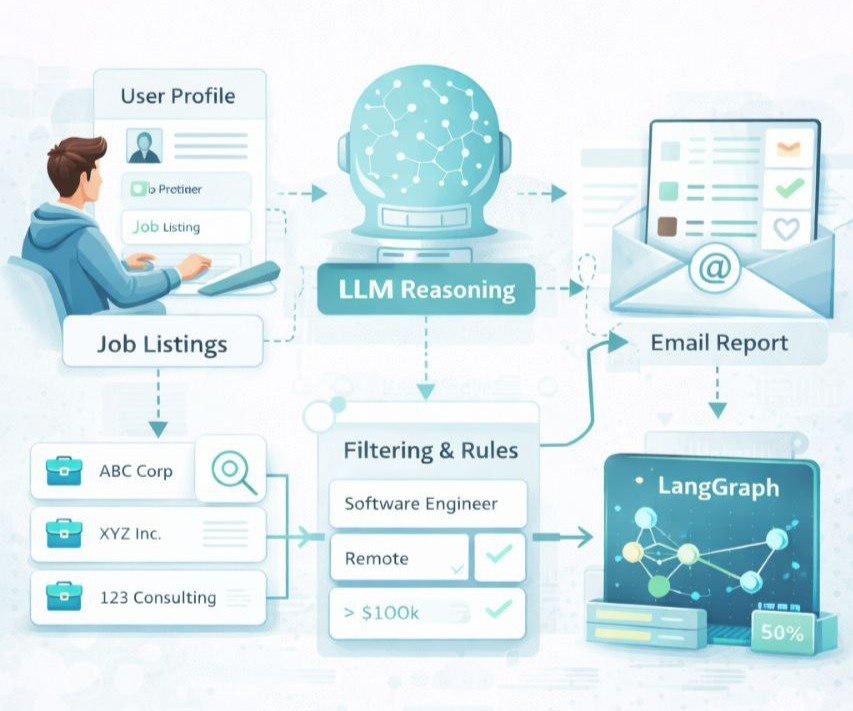
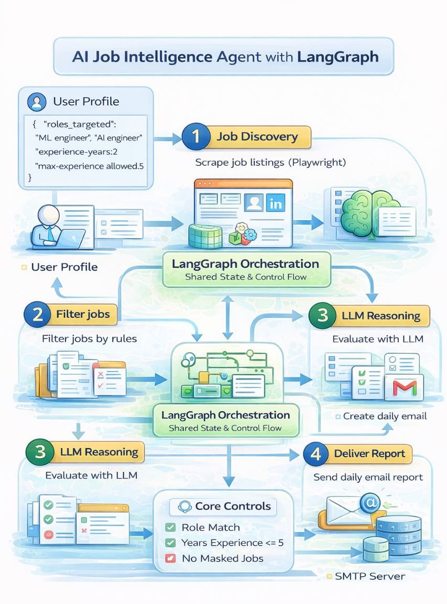

# 🤖 AI-Agent-Job-Evaluation-LangGraph-Based

An AI-powered job intelligence agent built using LangGraph, LLMs, and Playwright.

This project automatically:
- discovers relevant job listings,
- filters them using rules,
- reasons over them using an LLM,
- explains why a job fits or does not fit,
- highlights missing resume keywords,
- and sends a daily email report.

⚠️ This project does NOT auto-apply to jobs.  
It is a decision-support agent, not unsafe automation.

---

## ✨ What this project does

- Scrapes job listings from LinkedIn using Playwright
- Filters jobs using rule-based logic:
  - masked jobs
  - role mismatch
  - experience constraints
- Uses an LLM to:
  - decide APPLY vs SKIP
  - explain the decision
  - identify missing or weak resume keywords
- Orchestrates the full workflow using LangGraph
- Sends a human-readable email report (even if no jobs are found)

No UI.  
No frontend.  
Pure Python + agent orchestration.

---

## 📁 Project Structure

ProjectLG/
├── agent_graph.py        # ⭐ Main entry point (LangGraph agent)
├── job_discovery.py      # Job scraping + initial filtering
├── batch_reasoning.py    # Batch LLM evaluation logic
├── llm_reasoner.py       # Single-job LLM reasoning
├── email_report.py       # Converts decisions into readable report
├── email_sender.py       # Sends email via SMTP
│
├── user_profile.json     # User configuration / agent memory
├── requirements.txt
├── .env.example          # Environment variable template
├── README.md
└── .gitignore

---

## 🔧 Prerequisites

- Python 3.10+
- Internet connection
- Gmail account (for email delivery)
- OpenRouter API key (LLM access)

---

## 🚀 Step 1 — Create Virtual Environment

python -m venv venv

### Activate venv

Windows:
venv\Scripts\activate

Mac / Linux:
source venv/bin/activate

---

## 📦 Step 2 — Install Dependencies

pip install -r requirements.txt

If Playwright browsers are not installed:

playwright install

---

## 🔑 Step 3 — API & Email Setup

### OpenRouter (LLM access)

1. Create an account at https://openrouter.ai
2. Generate an API key

### Email (Gmail SMTP)

- Enable 2-Step Verification on Gmail
- Generate an App Password
- Do NOT use your normal Gmail password

---

## 🔐 Step 4 — Environment Variables

Create a .env file using .env.example as reference:

OPENROUTER_API_KEY=your_openrouter_api_key  
SENDER_EMAIL=your_email@gmail.com  
SENDER_PASSWORD=your_gmail_app_password  

⚠️ Never commit .env to GitHub.

---

## 👤 Step 5 — Configure User Profile

Edit user_profile.json:

{
  "roles_targeted": ["machine learning engineer", "ai engineer"],
  "experience_years": 2,
  "max_experience_allowed": 5,
  "email": "your_email@gmail.com"
}

This file acts as agent memory / configuration.

---

## 🧪 Step 6 — Run the Agent (FINAL)

python agent_graph.py

What happens:
1. Browser opens briefly (LinkedIn job search)
2. Jobs are discovered and filtered
3. LLM evaluates each job
4. Agent generates explanations
5. Email report is sent automatically

If no suitable jobs are found, you still receive a confirmation email.

---

## 🧠 Why LangGraph is used

- Makes agent steps explicit
- Enforces shared state
- Prevents hidden control flow
- Turns scripts into a real agent pipeline

Each step (discovery, reasoning, reporting) is a node in the graph.

---

## 🛡️ Design & Safety Notes

- ❌ No auto-apply
- ❌ No credential abuse
- ❌ No UI scraping beyond reading listings
- ✅ Human-in-the-loop decision support
- ✅ Explainable LLM outputs

---

## 🧠 Core Concepts Demonstrated

- Agentic workflows
- LangGraph state management
- Rule-based + LLM hybrid reasoning
- Real-world scraping constraints
- Explainable AI decisions
- Email-based human feedback loops

---

## 📌 Notes

- This is a learning-focused project
- Built step-by-step to understand agent architecture
- Emphasis on correctness, clarity, and explainability

---

## 📜 License

Personal / educational use.
